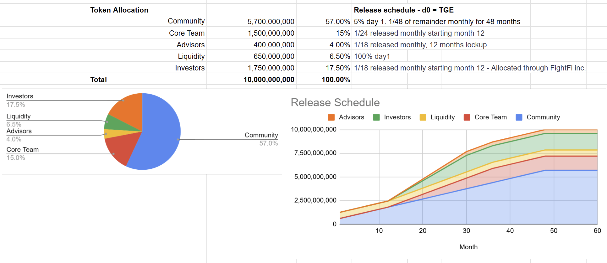

# Tokenomics

## Overview and Supply

$FIGHT is a Solana (SPL) access token with a **fixed maximum supply of 10,000,000,000 tokens**.  
At the Token Generation Event (TGE), the initial reference price is **$0.0500**, implying a **$500,000,000 fully diluted supply benchmark**. Circulating supply at TGE is expected to be **approximately 19.50% (1,950,000,000 $FIGHT)**, with all other tokens locked and vesting according to the schedules below.  

This structure provides transparency around token allocation while ensuring long-term alignment between community participants, contributors, and partners.  

> *Token supply and emission schedules are described for technical transparency only. No offer or solicitation is being made. Pricing and market data, if any, are indicative and provided by third parties.*

## Composition at TGE

Circulating tokens at launch consist of:  
- **Community**: 15.5% of total supply (1,550,000,000 $FIGHT)  
- **Liquidity**: 4% of total supply (400,000,000 $FIGHT)  

All other categories (Team, Investors, Advisors, etc.) begin fully locked. This design ensures that early supply is directed toward community participation and liquidity, not early unlocks. All unassigned tokens will be assigned to the Community treasury.

## Design Rationale

The initial mix supports stable market access and minimizes early unlock pressure. It focuses the first phase of circulation on genuine ecosystem participation—fans joining through FightID, staking, and fighter community activities—while maintaining transparency on vesting and governance processes managed by the DAO.

## Allocation and Release

### Community — 57.0% (5,700,000,000 $FIGHT)

**Release schedule:** 15.5% at TGE, 4% to treasury at month 1, then 1/48 of the remainder monthly over 48 months.  
**Purpose:** Airdrops, staking rewards, ecosystem grants, and community programs to engage fans, fighters, and builders.  
**Rationale:** The large community allocation ensures rewards can be distributed across multiple seasons, aligned with UFC's fight-week cadence and ongoing product launches. All unassigned tokens will be assigned to the Community treasury.

---

### Core Team — 15.0% (1,500,000,000 $FIGHT)

**Release schedule:** 12-month lockup, then 1/18 monthly over 18 months.  
**Rationale:** The one-year lockup ensures alignment with multi-season delivery and avoids short-term supply shocks. Token vesting follows published schedules governed by DAO transparency standards.

---

### Advisors — 4.0% (400,000,000 $FIGHT)

**Release schedule:** 12-month lockup, then 1/18 monthly over 18 months.  
**Administration:** Allocations are administered through **FightFi Inc.**  
**Rationale:** Strategic partners and advisors are compensated for distribution, listings, and ecosystem growth support, with long-term vesting that prevents early liquidity pressure.

---

### Liquidity — 6.5% (650,000,000 $FIGHT)

**Release schedule:** 4% of total supply at TGE (400,000,000 $FIGHT), 2.5% of total supply (250,000,000 $FIGHT) released linearly over 12 months starting month 1.  
**Rationale:** Initial liquidity at TGE ensures accessible entry points for fans and ecosystem participants while reducing slippage. Linear release over the first 12 months supports sustained market depth as the ecosystem matures and trading volume grows.

---

### Investors — 17.5% (1,750,000,000 $FIGHT)

**Release schedule:** 12-month lockup, then 1/18 monthly over 18 months.  
**Administration:** Allocations are administered through **FightFi Inc.**  
**Rationale:** Long-term vesting aligns capital partners with sustained growth, product maturity, and governance milestones.

---

---

## Token Vaults

The following vaults hold and secure $FIGHT tokens according to the allocation and release schedules outlined above:

### Anchorage Vaults (3/5 Multisig)

| Vault Name | Asset Type | Address |
|------------|-----------|---------|
| Community | BNB_BSC | 0xda7F3Db4a85F88A595aD770768107FF9b8a419D2 |
| Liquidity | SOL | 4388FZ2xuhc6LdLfs8h5M3TQCdfHmQQfqydbKTrG32DN |
| Core Team | SOL | 4PQ77Zj9FNPEkBhRNbqBcxF9G8ryEpTUqghCBD2kEsYu |
| Advisors | SOL | 7MUTKCUHTgC55kBRD3ouyFDVpKR2Gr7hxyAHNErtKg33 |
| Investors | SOL | EhRymXhn6fVJwvFobPWBLn7uog2XerPrv9J469xWbCxu |
| Community | SOL | UfxE9XWSVqZsCvQL92GUpAAf2hVSbTtRY9QCnJspJYG |

### Hot Multisig Wallets (3/4 Multisig)

**Squads (Solana):**

| Vault Name | Address |
|------------|---------|
| Community | GCQ8wGjU5TYmzC1YJckqgTGQLRjRxktB4rNuemPA9XWh |
| Team | AS53hhWLunsbjakHNKWD5L54ZrFHEGSNzowifp7CnMDG |
| Advisors | AxvEFAG2uvJoJj8nSsLh1uL2JEPHZm2rVj2Ru3ZMV3RM |
| Liquidity | 6TYnFMw4UQ6SB7Y9HQcU61wp64g14QqSqNQGzmQBGMHz |
| Investors | 6TYnFMw4UQ6SB7Y9HQcU61wp64g14QqSqNQGzmQBGMHz |

**BNB Safe:**

| Vault Name | Address |
|------------|---------|
| Hot Wallet | 0x1381c63F11Fe73998d80e2b42876C64362cF98Ab |

---

### Governance and Transparency

All token unlocks are executed through on-chain schedules and reported via DAO dashboards. Treasury policies governing emissions, grants, and liquidity programs are **community-approved and may be adjusted through governance proposals**.  

> *Nothing in this section should be interpreted as an offer of securities, a promise of future value, or an expectation of profit. All allocations and parameters are subject to change by DAO governance or legal requirements.*
